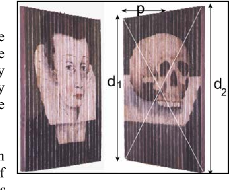
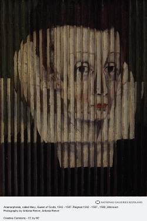

# Lenticular images in Python

## What is a lenticular image?
A lenticular image is a combination of two or more photos that present themselves from different viewing angles. For example:



From the left side you see a lady, from the right you see a skull. Standing in the middle you would see a combination of the two.

## How do they work?
Each image is cut into strips and then put back together by alternating strips from each image.



In older examples of this, the image would be printed on a very large surface which would then be folded back and forth:
```
/\/\/\/\/\
```
Where `/` is image A and `\` is image B. Because of the size of the print, only one viewing angle per image is possible, and the distance between the two was large enough that you would have to physically move yourself by multiple feet.

Recent technology allows us to print the strips much smaller, and directly onto a transparent plastic lens, making these images handheld. These lenses are available in many configurations - the most common of which is 60LPI, or Lines Per Inch. This means that for each inch of printed image, there are 60 lines (or strips) of photo.

## How big is each strip?

That's the tricky part - It depends on the size of the images, the resolution of the printer, the LPI of the lens, and other factors. Simply put, IDFK.


### Lenses

The lenses I am using are [from Amazon](https://www.amazon.com/gp/product/B01NBAHTBN).

* 14x20 inch
* 60 LPI
* Approximate 0.0161" thick
* Approximate 31º viewing angle

### Images
In this folder I have multiple sample images. The end goal of this project is to print batman and darth vader, frame it, and hang it on a wall next to a mirror so that they look like they are facing each other.

### Resolution
The batman/darth vader images are 3218x4096. Since this is a horizontal flip, the height doesn't matter so much. Unfortunately 3218/60=53.633, not a whole number. This means that the image must be resized to fit the lens, but we do not want to alter the original 1609:2048 aspect ratio too much because it would appear stretched.

### DPI vs PPI
> DPI: Dots Per Inch - for physical prints

> PPI: Pixels Per Inch - for digital images

In both cases, a higher number means better quality. Generally, 300 is acceptable.